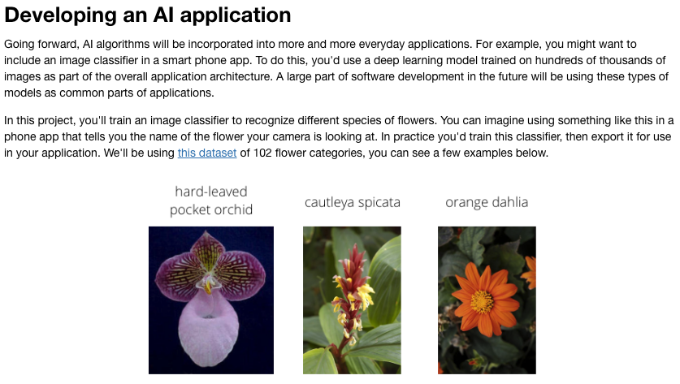

# PyTorch Scholarship Challenge
Start date: Nov 9, 2018  
End date: Jan 9, 2019

## Welcome to the Scolarship Challenge!
Welcome to the course! Here we'll get you oriented and set you up for success in this course.  
ETA 30 minutes

### Course Overview
Deep learning:  
- within the field of machine learning, using massive neural networks, massive datasets, and accelerated computing on GPU  
- impacts many industries already:  
   - personal voice assistants  
   - medical imaging  
   - automated vehicles  
   - video game AI  
   - etc  

### PyTorch
- is open-source Python framework from Facebook's AI research team
- used for developing deep neural networks

### Course Outline
1. Introduction to Neural Networks  
  - Learn the concepts behind deep learning and how we train deep neural networks with backpropagation.
2. Talking PyTorch with Soumith Chintala  
  - Cezanne Camacho and Soumith Chintala, the creator of PyTorch, chat about the past, present, and future of PyTorch.
3. Introduction to PyTorch  
  - Learn how to build deep neural networks with PyTorch  
  - Build a state-of-the-art model using a pre-trained network that classifies cat and dog images
4. Convolutional Neural Networks  
  - Here you'll learn about convolutional neural networks, powerful architectures for solving computer vision problems  
  - Build and train an image classifier from scratch to classify dog breeds
5. Style Transfer  
  - Use a trained network to transfer the style of one image to another image  
  - Implement the style transfer model from Gatys et al.
6. Recurrent Neural Networks  
  - Learn how to use recurrent neural networks to learn from sequences of data such as time series  
  - Build a recurrent network that learns from text and generates new text one character at a time
7. Sentiment Prediction with an RNN  
  - Build and train a recurrent network that can classify the sentiment of movie reviews
8. Deploying PyTorch Models  
  - Learn how to use PyTorch's Hybrid Frontend to convert models from Python to C++ for use in production

And we'll be ending with building this from scratch!!!  

## Introduction to Neural Networks
Learn the concepts behind how neural networks operate and how we train them using data.  
ETA 2 hours

### Introduction: What is Deep Learning and what is it used for?
Used for:  
- beating humans in games like Go and Jeopardy  
- detecting spam in emails  
- forecasting stock prices  
- recognizing images in a picture  
- diagnosing illnesses  
- self-driving cars

Neural Network:  
- imitates how a brain works  
- basically, finds a boundary between different categories (like different flower species)

### Classification Problems 1
**A simple example:**
We know that:  
- student A: 9/10 on a test, 8/10 grades - passes the class  
- student B: 3/10 on test, 4/10 grades - fails the class  
Does student C pass or fail? S/he has 7/10 on test, 6/10 grades? One way to find out is to plot the students' marks:

Great! Well, this boundary is easy for us to visualize, but not easy for a computer.

### Linear Boundaries
This boundary is linear; ie. a single, straight line. Calculated by .

For a computer, we need an equation to create this boundary.

A general linear boundary equation is , abbreviated in vector notation as , where *W* is the vector , *x* is the vector , and the equation is *W* times *x* plus *b*. We'll refer to *x* as the **inputs**, *W* as the **weights**, and *b* as the **bias**.

*y* is the label that we're trying to predict. It'll be either 1 or 0 (ie, true or false, in this case); 1 if *y* is above the line (ie ), or 0 if *y* is below the line (ie < 0).

Our prediction will be *"y hat equals 1 if above the line, or y hat equals 0 if below the line"*:  
.

***NOTE:*** y is the ACTUAL solution vector, while  is the PREDICTED solution.

### Higher Dimensions
Higher dimensional boundaries are needed when there are more data points to look at.  
For instance, a plane boundary (a flat surface) occurs when there is .  
There are also even higher dimensions with .

### Perceptrons
- the building block of neural networks
- just an encoding of our equation into a small graph:  
   - each input (x) is in a node  
   - the weights (w) are labeled on the *edges* (the arrows) of the input nodes  
   - the bias (b) can either be in the calculation node or an "input" node  
   - the calculation is also in a node  
   - the prediction (score or y-hat) is the return value

In our example, we're using an implicit function called a **step function**. This is sometimes viewed in its own node, in which case the *linear function* is in a node where the calculation occurs ("the first node calculates the linear equation on the inputs of the weights"), and the *step function* is in a node where the step function is applied to the result of the calculation.

In the future, we'll be using different step functions, so it is useful to specify it in the node.

### Why 'Neural Networks'? ###
Why are they called neural networks?

In the same way the *input* nodes are one-way to the calculation node, resulting in a one-way output, a neuron's *dendrites* give a one-way input to the *nucleus*, where something is decided, and a one-way electrical impulse is sent (or not?) out through the *axon*.

So far, we're working with a single "neuron". Later it'll get more complicated with whole networks of these calculations!

### Perceptrons as Logical Operators ###
Perceptrons can be used as logical operators as well.

#### AND Perceptron
QUIZ: What are the weights and bias for the AND perceptron?  
More than 1 set of values will work!

#### OR Perceptron
QUIZ: What are the weights and bias for the OR perceptron?  
Basically, the weights work together to create the angle of the linear boundary (think of it like a teeter-totter where different weights on the x's change the angle) and the bias (actually it's the *difference* between the bias and the weighted inputs) sort of moves that boundary left or right. SO to move the boundary over (while maintaining the same angle), you can either change the weights (by the same amount) OR change the bias.

#### NOT Perceptron ####
The **NOT** only cares about a single input (like, for input (0, 1) it cares only about either the 0 or the 1); all other inputs are ignored. This single input is then turned into the opposite.

#### XOR Perceptron ####
The **XOR** perceptron returns a positive value ONLY when the inputs are different (I think?). 

As you can see, it's not the regular **OR** since the first input (1,1) returns a false value! To get around this, we have to create a *multi-layer perceptron* or a (very basic) neural network. 

**NAND** is short for **NOT AND**.  

  

### Perceptron Trick ###
Since we can't calculate the linear boundary by hand every time, we can get a computer to find the equation. How do we do that? Using the Perceptron Trick!  

The computer begins with a random equation (random line). The correctly classified data points say "I am good!", and the incorrect points say "Come closer!". Obviously the computer doesn't understand English that way (and nor do the points), so it's using an adjustment equation.

Example: A random equation of . If we have a point (1,1) inside the current negative area that should be in the positive area, the computer should add the data point to the equation (with 1 as the bias). However, since this drastically changes the equation and might be overkill, we use a ***learning rate***. In this case it'll be 0.1, so we only add a 10th of the incorrectly classified data point. So the new equation becomes .

The computer continues doing this until it correctly classifies all (or, more probably, most) of the data points.  In this example, it would do this 10 times to get the point (1,1) into the positive area.

NOTE: If a data point is incorrectly classified in the positive area, a 10th of that data point should be *subtracted* from the equation.

### Perceptron Algorithm ###
The algorithm is just the equation in "math" terms. The  is the *learning rate*, and coordinates are (p, q).

### Non-Linear Regions

### Error Functions

### Log-loss Error Function

### Discrete vs Continuous

### Softmax

### One-Hot Encoding

### Maximum Likelihood

### Maximizing Probabilities

### Cross-Entropy 1

### Cross-Entropy 2

### Multi-Class Cross Entropy

### Logistic Regression

### Gradient Descent

### Logistic Regression Algorithm

### Pre-Notebook: Gradient Descent

### Notebook: Gradient Descent

### Perceptron vs Gradient Descent

### Continuous Perceptrons

### Non-Linear Data

### Non-Linear Models

### Neural Network Architecture

### Feedforward

### Backpropagation

### Pre-Notebook: Analyzing Student Data

### Notebook: Analyzing Student Data

### Training Optimization

### Testing

### Overfitting and Underfitting

### Early Stopping

### Regularization

### Regularization 2

### Dropout

### Local Minima

### Random Restart

### Vanishing Gradient

### Other Activation Functions

### Batch vs Stochastic Gradient Descent

### Learning Rate Decay

### Momentum

### Error Functions Around the World

## Talking PyTorch with Soumith Chintala
Hear from Soumith Chintala, the creator of PyTorch, about the past, present, and future of the PyTorch framework.

ETA 30 minutes

## Introducation to PyTorch
Learn how to use PyTorch to build and train deep neural networks. By the end of this lesson, you will build a network that can classify images of dogs and cats with state-of-the-art performance.

ETA 2 hours

## Convolutional Neural Networks
Learn how to use convolutional neural networks to build state-of-the-art computer vision models.

ETA 5 hours

## Style Transfer
Use a deep neural network to transfer the artistic style of one image onto another image.

ETA 5 hours

## Recurrent Neural Networks
Learn how to use recurrent neural networks to learn from sequential data such as text. Build a network that can generate realistic text one letter at a time.

ETA 5 hours

## Sentiment Prediction with RNNs
Here you'll build a recurrent neural network that can accurately predict the sentiment of movie reviews.

ETA 2 hours

## Deploying PyTorch Models
In this lesson, we'll walk through a tutorial showing how to deploy PyTorch models with Torch Script.

ETA 30 minutes

## Challenge Project
Build and train a model that identifies flower species from images.

__*This is part of the scholarship assessment!*__
We'll build a deep learning model from scratch!
After training and optimizing your model, it'll be uploaded to a workspace where it will receive a score based on accuracy predicting flower species from a test set. This score will be used in the decision process for awarding scholarships!!!

